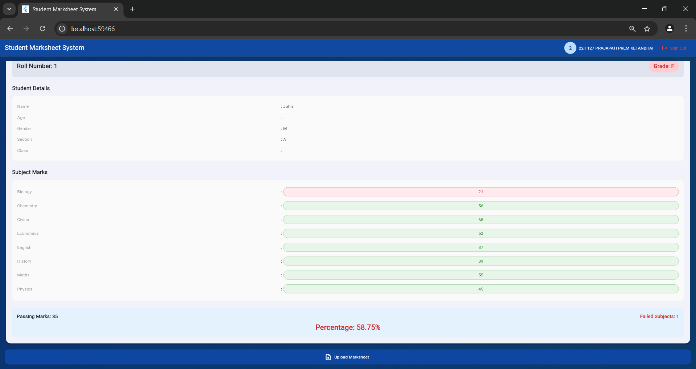

# Student Marksheet System

A Flutter-based web application for managing and viewing student marksheets with Firebase integration.

## Features

- 🔐 Secure Google Sign-In authentication
- 📊 Upload and process marksheets in CSV/Excel format
- 🔍 Search students by roll number and name
- 📈 Calculate percentage and grades automatically
- 🎯 Customizable passing marks
- 📱 Responsive design for all devices
- 🌈 Modern and intuitive user interface

## Project Languages & Configuration Files

### Programming Languages
- **Dart**
  - Primary language used for Flutter development
  - Handles all application logic and UI components
  - Version: Dart 3.0 or higher

- **JavaScript**
  - Used for web-specific implementations
  - Handles Firebase web integration
  - Manages browser-based authentication

### Configuration Files
- **CMake**
  - Build system for native code compilation
  - Handles C++ dependencies for Flutter
  - Used in Windows/Linux builds
  - Located in `windows/CMakeLists.txt`

- **Swift**
  - Used for iOS-specific implementations
  - Handles native iOS features
  - Located in `ios/Runner/` directory

- **Kotlin**
  - Used for Android-specific implementations
  - Handles native Android features
  - Located in `android/app/` directory

- **YAML**
  - Used for Flutter project configuration
  - Defines project dependencies and assets
  - Main file: `pubspec.yaml`

### Web Files
- **HTML**
  - Entry point for web application
  - Contains web-specific configurations
  - Located in `web/index.html`

- **CSS**
  - Styles for web application
  - Customizes web-specific appearance
  - Located in `web/styles.css`

## Screenshots

### Login Screen with Google Sign-In

*Modern login interface with Google authentication*

### Dashboard Screen

*Dashboard with search functionality and file upload*

### Search Results with Grade Display

*Detailed student results with color-coded grades*

## Prerequisites

- Flutter SDK (latest version)
- Firebase account
- Web browser (Chrome recommended)

## Libraries Used

### Firebase Libraries
- **firebase_core: ^2.24.2**
  - Core Firebase functionality
  - Required for initializing Firebase in the application

- **firebase_auth: ^4.15.3**
  - Handles authentication with Firebase
  - Manages Google Sign-In integration

- **firebase_database: ^10.3.8**
  - Realtime Database integration
  - Stores and retrieves student marksheet data

### File Handling Libraries
- **file_picker: ^6.1.1**
  - Enables file selection for marksheet upload
  - Supports both CSV and Excel files

- **excel: ^4.0.2**
  - Processes Excel (.xlsx) files
  - Extracts data from spreadsheets

- **csv: ^5.1.1**
  - Handles CSV file parsing
  - Converts CSV data to structured format

### UI Libraries
- **flutter_material: latest**
  - Material Design components
  - Modern and responsive UI elements

- **google_sign_in: ^6.2.1**
  - Implements Google Sign-In functionality
  - Provides secure authentication flow

- **google_sign_in_web: ^0.12.0**
  - Web-specific implementation of Google Sign-In
  - Handles browser-based authentication

## External APIs & Services

### Firebase APIs
- **Firebase Authentication API**
  - Handles secure user authentication
  - Manages Google Sign-In integration
  - Provides user session management
  - Endpoint: `https://identitytoolkit.googleapis.com/`

- **Firebase Realtime Database API**
  - Stores and retrieves student marksheet data
  - Handles real-time data synchronization
  - Manages data queries and filtering
  - Endpoint: `https://marksheet-project-f6255-default-rtdb.firebaseio.com/`

### Google APIs
- **Google Sign-In API**
  - Provides secure OAuth 2.0 authentication
  - Manages user consent and permissions
  - Returns user profile information
  - Endpoint: `https://accounts.google.com/o/oauth2/`

### File Processing APIs
- **Excel File Processing**
  - Library: `excel: ^4.0.2`
  - Handles .xlsx file parsing
  - Supports multiple sheets and formatting
  - Used for marksheet uploads

- **CSV Processing**
  - Library: `csv: ^5.1.1`
  - Parses CSV file data
  - Handles different delimiters and formats
  - Used for marksheet uploads

## API Implementation Details

### Firebase Authentication API
```dart
// lib/screens/login_screen.dart
Future<void> _signInWithGoogle() async {
  try {
    GoogleAuthProvider googleProvider = GoogleAuthProvider();
    googleProvider.addScope('email');
    googleProvider.setCustomParameters({
      'prompt': 'select_account'
    });
    
    final UserCredential userCredential = 
        await FirebaseAuth.instance.signInWithPopup(googleProvider);
  } catch (e) {
    // Error handling
  }
}
```

### Firebase Realtime Database API
```dart
// lib/screens/dashboard_screen.dart
// Storing marksheet data
await _database.child('marksheets').child(rollNo).set({
  'student_info': {
    'roll_no': originalRollNo,
    'name': details['Name'] ?? '',
    // ... other student details
  },
  'academic_marks': marks,
  'results': {
    'percentage': percentage.toStringAsFixed(2),
    'grade': grade,
  }
});

// Retrieving marksheet data
final snapshot = await _database
    .child('marksheets')
    .child(rollNo)
    .get();
```

### File Processing APIs
```dart
// lib/screens/dashboard_screen.dart
// Excel Processing
if (extension == 'xlsx') {
  final excelFile = excel.Excel.decodeBytes(bytes!);
  await _processAndStoreExcelData(excelFile);
}

// CSV Processing
if (extension == 'csv') {
  final csvString = String.fromCharCodes(bytes!);
  final rows = const CsvToListConverter().convert(csvString);
  await _processAndStoreData(rows);
}
```

### Google Sign-In API
```dart
// lib/main.dart
void main() async {
  await Firebase.initializeApp(
    options: const FirebaseOptions(
      apiKey: "YOUR_API_KEY",
      authDomain: "YOUR_AUTH_DOMAIN",
      // ... other Firebase configuration
    ),
  );
}
```

## Installation

1. Clone the repository:
```bash
git clone https://github.com/yourusername/marksheet-project.git
```

2. Navigate to the project directory:
```bash
cd marksheet-project
```

3. Install dependencies:
```bash
flutter pub get
```

4. Run the application:
```bash
flutter run -d chrome
```

## Usage

### Login
- Click the "Sign in with Google" button
- Select your Google account
- Grant necessary permissions

### Dashboard
1. Enter roll number and optional name to search
2. Set passing marks (default: 35)
3. Click Search to view results
4. Use Upload Marksheet button to add new records

### Uploading Marksheets
1. Prepare your marksheet in CSV or Excel format
2. Click Upload Marksheet
3. Select your file
4. The system will process and store the data automatically

## File Format Requirements

### CSV Format
- First row should contain headers
- First column must be Roll Number
- Required columns: Name, Age, Gender, Class, Section
- Additional columns for subject marks

### Excel Format
- Same structure as CSV
- First sheet will be processed
- First row should contain headers

## Grading System

- A+: 90% and above
- A: 80% - 89%
- B: 70% - 79%
- C: 60% - 69%
- D: 50% - 59%
- F: Below 50% or any subject below passing marks
